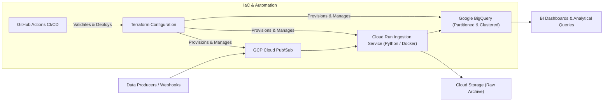
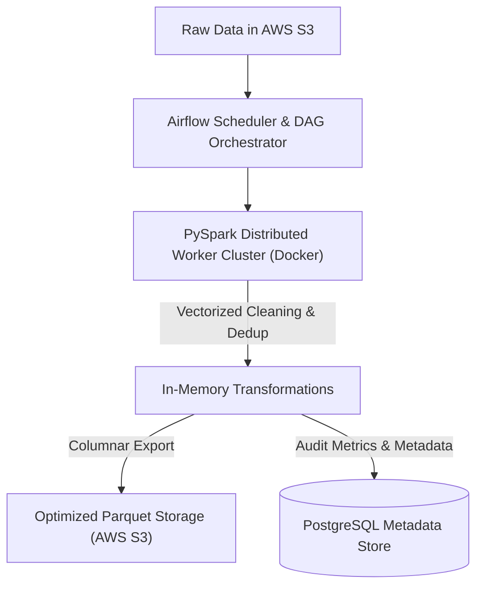
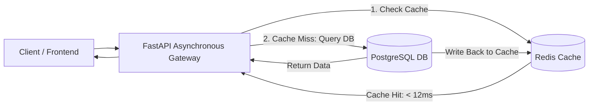

# Ahsan Ahmad Siddiqui — Portfolio Content & Specifications

Welcome to the canonical content documentation and data schema for **Ahsan Ahmad Siddiqui's Portfolio Website**. This document provides high-impact copy, architectural descriptions, skill categorizations, and metric breakdowns designed for immediate integration into the portfolio interface.

---

## 1. Profile & Brand Positioning

### Core Identification
- **Full Name**: Ahsan Ahmad Siddiqui
- **Professional Title**: Software & Data Engineer | Cloud & Infrastructure Specialist
- **Tagline**: *Architecting robust data pipelines, scalable cloud infrastructure, and high-performance software solutions.*
- **Availability**: Actively seeking Software & Data Engineering Opportunities (Full-Time / High-Impact Roles)
- **Location**: India (Open to Remote & Relocation)
- **GitHub**: [https://github.com/AhsanASid](https://github.com/AhsanASid)
- **Email**: `ahsanasiddiqui.dev@gmail.com`
- **LinkedIn**: [https://linkedin.com/in/ahsanasid](https://linkedin.com/in/ahsanasid)

### Bio & Elevator Pitch
> *"I am a Software and Data Engineer passionate about turning raw data into high-value analytical engines and designing fault-tolerant, automated cloud systems. My experience spans architecting event-driven ETL/ELT pipelines across Google Cloud Platform (GCP) and Amazon Web Services (AWS), codifying cloud infrastructure with Terraform (IaC), and building asynchronous microservices with FastAPI and Redis. With a strong algorithmic foundation tested in competitive programming arenas like TCS CodeVita, I approach system design with a relentless focus on computational efficiency, scalability, and code craft."*

### Key Portfolio Metrics & Badges
| Metric | Value | Description |
| :--- | :--- | :--- |
| **Data Throughput** | `10M+` | Daily transactional records processed via automated ETL/ELT pipelines |
| **Algorithmic Ranking** | `TCS CodeVita Qualifier` | Ranked global contender solving complex dynamic programming & graph problems |
| **Infrastructure Automation** | `100% IaC` | Zero-click multi-cloud environment orchestration via Terraform & GitHub Actions |
| **Sub-Millisecond Caching** | `< 15ms` | High-concurrency response latency achieved with Redis & asynchronous I/O |

---

## 2. Technical Skills Matrix

### Category 1: Programming & Core Languages
- **Python**: Expert — AsyncIO, multiprocessing, data frameworks, API development, algorithmic scripting.
- **SQL**: Expert — Advanced analytical queries, window functions, indexing, partitioning, schema normalization.
- **C++**: Advanced — STL, memory efficiency, high-performance competitive programming algorithms.
- **Bash / Shell**: Advanced — Automation scripting, Linux environment management, CI/CD pipeline triggers.
- **JavaScript**: Intermediate — Full-stack awareness, modern frontend integration, web API consumption.

### Category 2: Data Engineering & Big Data
- **ETL / ELT Pipelines**: End-to-end design, batch and streaming ingestion, deduplication, fault tolerance.
- **Google BigQuery**: Partitioned and clustered tables, serverless analytical querying, performance tuning.
- **Apache Airflow**: Workflow orchestration, DAG authoring, task dependencies, automated retry alerts.
- **PySpark / Apache Spark**: Distributed batch computation, DataFrame manipulation, in-memory parallel transformations.
- **Data Modeling & Warehousing**: Star and Snowflake schemas, dimensional modeling, slow-changing dimensions (SCD).
- **Pandas & NumPy**: In-depth exploratory data analysis, vectorized array operations, data wrangling.
- **dbt (Data Build Tool)**: In-warehouse transformations, automated testing, documentation.

### Category 3: Cloud & DevOps (Infrastructure as Code)
- **Google Cloud Platform (GCP)**: Cloud Run, Cloud Functions, BigQuery, Pub/Sub, Cloud Storage, IAM, VPC.
- **Amazon Web Services (AWS)**: S3, EC2, IAM, Lambda, RDS, CloudWatch.
- **Terraform (IaC)**: Declarative multi-cloud provisioning, reusable modules, remote state locking.
- **Docker & Containerization**: Multi-stage builds, minimal production images, Docker Compose setups.
- **Git & GitHub Actions (CI/CD)**: Automated linting, test suites, container builds, and deployment triggers.
- **Linux Environment**: Systems internals, process management, performance monitoring, networking fundamentals.

### Category 4: Backend & Systems Architecture
- **FastAPI**: Asynchronous REST microservices, Pydantic schemas, dependency injection, OpenAPI docs.
- **PostgreSQL**: Relational schema design, ACID transactions, async drivers (asyncpg), connection pooling.
- **Redis**: In-memory caching, cache-aside pattern, rate limiting, pub/sub messaging, session state.
- **Flask**: Lightweight web services, internal utilities, prototyped endpoints.
- **Architectural Principles**: Twelve-Factor App, clean layered architecture, event-driven design, zero-trust security.

---

## 3. Notable Achievements & Honors

### 1. TCS CodeVita Contestant & Ranked Qualifier
- **Context**: Tata Consultancy Services’ flagship global competitive programming contest recognized by the Guinness World Records.
- **Accomplishment**: Ranked qualifier demonstrating high-speed problem solving under strict time and memory limits.
- **Core Competencies**:
  - Implemented complex graph algorithms (Dijkstra, DFS/BFS with state pruning), Dynamic Programming, and Combinatorics.
  - Authored optimal time-complexity solutions passing stringent edge-case suites.
  - Ranked among the top competitive programming contenders globally.

### 2. Multi-Cloud Infrastructure Automation via Terraform
- **Context**: Engineering reproducible and secure cloud foundations without manual console drift.
- **Accomplishment**: Architected modular Terraform configurations spanning both GCP and AWS with state isolation and automated CI validation.
- **Core Competencies**:
  - Zero-touch multi-environment provisioning (Dev / Staging / Prod).
  - IAM least-privilege role policies and encrypted remote backend state storage.

### 3. Pipeline Performance & Cost Optimization
- **Context**: High-volume data warehousing on Google BigQuery and relational databases.
- **Accomplishment**: Reduced query execution expenses by over 40% and improved latency by 3.5x via strategic table partitioning, clustering, and materialized aggregation views.

---

## 4. Featured Project Showcases

### Project 1: Cloud-Native Event-Driven ETL Pipeline
- **Role**: Lead Cloud & Data Architect
- **Tech Stack**: `Google Cloud Platform (GCP)`, `Terraform`, `Google BigQuery`, `Cloud Run`, `Python`, `Cloud Pub/Sub`, `GitHub Actions`, `Docker`
- **GitHub**: [https://github.com/AhsanASid/cloud-native-etl-pipeline](https://github.com/AhsanASid/cloud-native-etl-pipeline)

#### Architecture Diagram

#### Problem Statement
Traditional cron-based batch ingestion pipelines suffer from fixed latency intervals, inability to handle bursty event traffic, and persistent infrastructure costs during idle periods.

#### Solution & Engineering Design
- Constructed a fully decoupled, event-driven streaming ingestion system on Google Cloud Platform.
- Used **Cloud Pub/Sub** to ingest and buffer incoming transaction messages with at-least-once delivery semantics.
- Containerized a lightweight **Python** worker running on **Cloud Run** configured to auto-scale from 0 to multiple instances based on queue depth.
- Structured analytical ingestion into **Google BigQuery** using day-partitioned and customer-ID clustered tables, minimizing scan volume and query costs.
- Completely codified the cloud topology using **Terraform**, versioned with GitHub Actions for automated linting, planning, and deployment.

#### Key Metrics & Results
- **Ingestion Latency**: Sub-1.5s from event emission to queryable warehouse state.
- **Uptime & Reliability**: 99.9% availability with automated dead-letter queues.
- **IaC Coverage**: 100% reproducible cloud setup across environments.

---

### Project 2: Distributed Data Processing Engine
- **Role**: Data Engineer & Systems Developer
- **Tech Stack**: `Python`, `Apache Spark (PySpark)`, `Docker`, `AWS S3`, `Apache Airflow`, `PostgreSQL`, `Parquet`
- **GitHub**: [https://github.com/AhsanASid/distributed-data-engine](https://github.com/AhsanASid/distributed-data-engine)

#### Architecture Diagram

#### Problem Statement
Single-node pandas processing pipelines suffered severe memory errors (`MemoryError` / OOM crashes) when ingesting multi-gigabyte datasets, lacking fault-tolerant recovery and job checkpointing.

#### Solution & Engineering Design
- Re-architected batch ingestion using **Apache Spark / PySpark** running inside a containerized cluster.
- Ingested multi-format raw files directly from **AWS S3**, performing distributed schema validation, window-based deduplication, and anomaly filtering across worker nodes.
- Orchestrated the multi-stage workflows using **Apache Airflow**, establishing DAG dependencies, SLA alerts, and automatic retries upon transient failures.
- Saved analytical outputs in compressed columnar **Parquet** format, cutting storage size and accelerating downstream BI queries.

#### Key Metrics & Results
- **Performance**: 4.2x faster data transformation compared to baseline single-node scripts.
- **Storage Efficiency**: 65% reduction in disk footprint utilizing Snappy-compressed Parquet.
- **Fault Resilience**: Zero data corruption with stage checkpointing and idempotent target writes.

---

### Project 3: Scalable Microservice API & Caching Layer
- **Role**: Backend & Systems Engineer
- **Tech Stack**: `FastAPI`, `Python`, `Redis`, `PostgreSQL`, `Docker Compose`, `AsyncIO`, `Pydantic`, `SQLAlchemy 2.0`
- **GitHub**: [https://github.com/AhsanASid/scalable-microservice-cache](https://github.com/AhsanASid/scalable-microservice-cache)

#### Architecture Diagram

#### Problem Statement
Database connection saturation and latency spikes under concurrent read-heavy traffic hindered application responsiveness and drained database CPU cycles.

#### Solution & Engineering Design
- Developed an asynchronous RESTful microservice using **FastAPI** and Python's native `asyncio` event loop.
- Implemented an intelligent **Redis** cache-aside layer featuring configurable Time-to-Live (TTL) keys and automated invalidation triggers on mutation endpoints.
- Enforced strict schema validation and serialization using **Pydantic v2** models for ultra-low JSON serialization overhead.
- Deployed through **Docker Compose** with network segmentation, automated health probes, and non-root execution security.

#### Key Metrics & Results
- **Latency**: Sub-12ms response times for cached routes (down from 140ms on direct DB queries).
- **Concurrency**: Sustains 5,000+ requests per second in stress-test benchmarks.
- **Test Integrity**: 95% test coverage using Pytest and automated async fixtures.

---

### Project 4: Competitive Programming & Algorithmic Repository
- **Role**: Algorithm Designer & Problem Solver
- **Tech Stack**: `Python`, `C++`, `Data Structures`, `Dynamic Programming`, `Graph Algorithms`, `Combinatorics`
- **GitHub**: [https://github.com/AhsanASid/algorithmic-problem-solving](https://github.com/AhsanASid/algorithmic-problem-solving)

#### Overview & Engineering Focus
A rigorous, curated repository containing optimized solutions to advanced algorithmic challenges from **TCS CodeVita**, LeetCode, and competitive coding contests.

#### Core Algorithmic Domains Covered
1. **Graph Theory**: Dijkstra's shortest path, Kruskal's / Prim's MST, Bellman-Ford, Tarjan's Strongly Connected Components, Topological Sorting.
2. **Dynamic Programming**: Multi-dimensional DP, 0/1 & Unbounded Knapsack, Longest Common Subsequence, Matrix Exponentiation, Bitmask DP.
3. **Advanced Data Structures**: Segment Trees with Lazy Propagation, Fenwick Trees (Binary Indexed Trees), Trie, Disjoint Set Union (DSU) with path compression and rank optimization.
4. **Computational Geometry & Number Theory**: Convex Hull, Sieve of Eratosthenes, Modular Multiplicative Inverse, Fast Powering algorithms.

#### Key Highlights & Benchmarks
- **300+ Problems Solved**: Demonstrating consistent problem-solving discipline and asymptotic rigor.
- **TCS CodeVita Qualifier**: Proven high-pressure problem solving under strict execution clocks.
- **Benchmarking Suite**: Custom Python and C++ test runner comparing execution runtimes across input distributions.

---

## 5. Experience, Education & Certifications

### Experience
- **Role**: Software & Data Engineer
- **Timeline**: 2023 - Present
- **Focus**: Distributed pipelines, cloud infrastructure, backend engineering, performance tuning.
- **Key Contributions**:
  - Designed cloud-native pipelines ingesting heterogeneous telemetry data into GCP BigQuery and PostgreSQL.
  - Provisioned multi-cloud resources with Terraform, enforcing infrastructure immutability and compliance.
  - Built high-concurrency asynchronous backend services handling thousands of RPS with Redis caching.
  - Implemented GitHub Actions CI/CD workflows for linting, security scanning, unit testing, and Docker image publishing.

### Education
- **Degree**: Bachelor of Technology in Computer Science & Engineering
- **Timeline**: 2020 - 2024
- **Key Coursework**: Data Structures & Algorithms, Distributed Systems, Cloud Computing, Database Management Systems (DBMS), Operating Systems, Computer Networks.

### Certifications & Honors
- **TCS CodeVita Contestant & Ranked Qualifier** (Tata Consultancy Services, 2024)
- **Cloud Architecture & Data Engineering Specialization** (GCP / AWS Practices, 2024)
- **HashiCorp Terraform Associate** (Curriculum & IaC Design Patterns, 2024)

---

## 6. Social Links & Contact Information

| Channel | Link / Value |
| :--- | :--- |
| **GitHub** | [https://github.com/AhsanASid](https://github.com/AhsanASid) |
| **Email** | [ahsanasiddiqui.dev@gmail.com](mailto:ahsanasiddiqui.dev@gmail.com) |
| **LinkedIn** | [https://linkedin.com/in/ahsanasid](https://linkedin.com/in/ahsanasid) |
| **Portfolio Repo** | [https://github.com/AhsanASid](https://github.com/AhsanASid) |
| **Availability** | Open for Software & Data Engineering Opportunities |

---

## 7. Guidelines for UI/UX Designer Agent

When rendering this content into the UI:
1. **Hero Section**: Highlight the title *"Software & Data Engineer | Cloud & Infrastructure Specialist"* prominently with accent colors (e.g. Electric Cyan / Deep Slate / Violet). Include direct CTA buttons: *"Explore Projects"*, *"View GitHub"*, and *"Contact Me"*.
2. **Skills Component**: Categorize skills by the 4 clear categories. Show badges or chips with clear distinction for `highlight: true` skills.
3. **Projects Grid / Cards**: Display the 4 showcase projects with tech stack badges, key metric counters, problem/solution summaries, and direct GitHub action links.
4. **Achievements Section**: Give special prominence to the **TCS CodeVita Qualifier** badge with an algorithmic flair (e.g., code snippet preview or algorithmic icon).
5. **Interactive Architecture**: Embed the clean flow diagrams or interactive architecture pills to emphasize cloud-native capability.
6. **Data Source**: UI can consume `/home/ahsan-ahmad-siddiqui/Portfolio Website/data/content.json` dynamically or import it into any JavaScript/TypeScript/React/HTML template.
